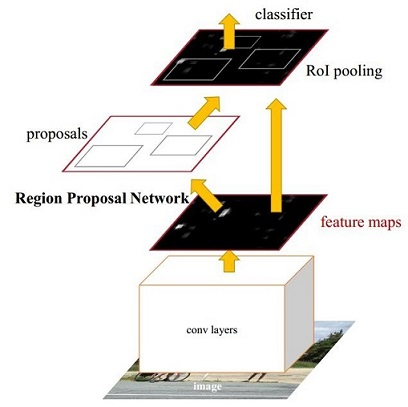

# Faster RCNN
经过R-CNN和Fast RCNN的积淀，Ross B. Girshick在2016年提出了新的Faster RCNN，在结构上，Faster RCNN已经将特征抽取(feature extraction)，proposal提取，bounding box regression(rect refine)，
classification都整合在了一个网络中，使得综合性能有较大提高，在检测速度方面尤为明显。

#目录
1 Conv layers

2 Region Proposal Networks(RPN)
- 2.1 多通道图像卷积基础知识介绍
- 2.2 anchors
- 2.3 softmax判定positive与negative
- 2.4 bounding box regression原理
- 2.5 对proposals进行bounding box regression
- 2.6 Proposal Layer

3 RoI pooling
- 3.1 为何需要RoI Pooling
- 3.2 RoI Pooling原理

4 Classification

5 Faster RCNN训练
- 5.1 训练RPN网络
- 5.2 通过训练好的RPN网络收集proposals
- 5.3 训练Faster RCNN网络

# 网络结构

